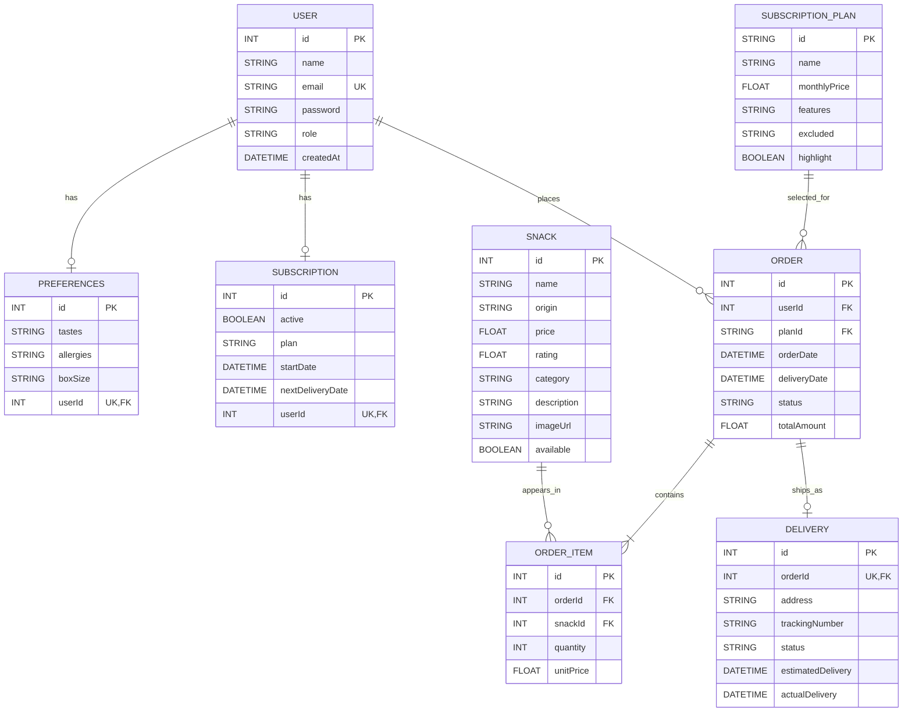

# SnackSafari - ER Diagram

Implementation-aligned ERD based on Prisma schema and SQLite.

```mermaid
erDiagram
    USER {
        INT id PK
        STRING name
        STRING email UK
        STRING password
        STRING role
        DATETIME createdAt
    }

    PREFERENCES {
        INT id PK
        STRING tastes
        STRING allergies
        STRING boxSize
        INT userId UK,FK
    }

    SUBSCRIPTION {
        INT id PK
        BOOLEAN active
        STRING plan
        DATETIME startDate
        DATETIME nextDeliveryDate
        INT userId UK,FK
    }

    SNACK {
        INT id PK
        STRING name
        STRING origin
        FLOAT price
        FLOAT rating
        STRING category
        STRING description
        STRING imageUrl
        BOOLEAN available
    }

    SUBSCRIPTION_PLAN {
        STRING id PK
        STRING name
        FLOAT monthlyPrice
        STRING features
        STRING excluded
        BOOLEAN highlight
    }

    ORDER {
        INT id PK
        INT userId FK
        STRING planId FK
        DATETIME orderDate
        DATETIME deliveryDate
        STRING status
        FLOAT totalAmount
    }

    ORDER_ITEM {
        INT id PK
        INT orderId FK
        INT snackId FK
        INT quantity
        FLOAT unitPrice
    }

    DELIVERY {
        INT id PK
        INT orderId UK,FK
        STRING address
        STRING trackingNumber
        STRING status
        DATETIME estimatedDelivery
        DATETIME actualDelivery
    }

    USER ||--o| PREFERENCES : has
    USER ||--o| SUBSCRIPTION : has
    USER ||--o{ ORDER : places
    SUBSCRIPTION_PLAN ||--o{ ORDER : selected_for
    ORDER ||--|{ ORDER_ITEM : contains
    SNACK ||--o{ ORDER_ITEM : appears_in
    ORDER ||--o| DELIVERY : ships_as
```

## Relationship Notes

- One user has at most one preference record and one subscription record.
- One user can place many orders.
- Each order belongs to one subscription plan and has many order items.
- Each order item points to one snack.
- Each order can have at most one delivery record.
