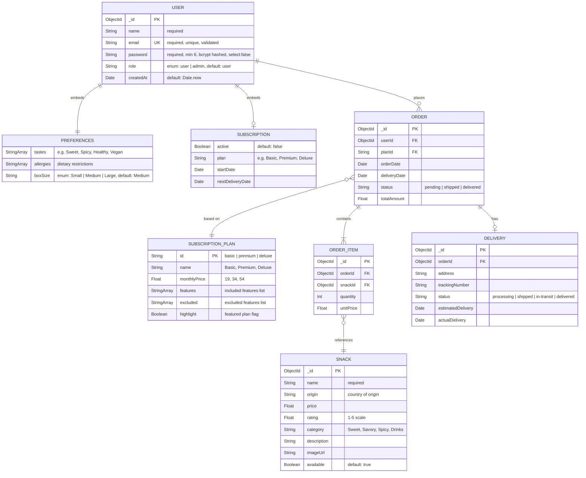

# SnackSafari — ER Diagram

> Based on the current MongoDB/Mongoose schema. Relationships shown follow document embedding and reference patterns.

---

## Entity Descriptions

### Currently Implemented (in codebase)

| Entity | Storage | Description |
|--------|---------|-------------|
| **USER** | MongoDB Collection | Core user document with auth credentials and role |
| **PREFERENCES** | Embedded in USER | User's snack taste preferences, allergies, and box size |
| **SUBSCRIPTION** | Embedded in USER | Active subscription status, plan type, and delivery dates |

### Planned / Implied by UI (future scope)

| Entity | Storage | Description |
|--------|---------|-------------|
| **SNACK** | MongoDB Collection | Individual snack products (currently static data in frontend) |
| **SUBSCRIPTION_PLAN** | MongoDB Collection | Plan tiers with pricing and features (currently static in PlansPage) |
| **ORDER** | MongoDB Collection | Monthly auto-generated orders tied to subscriptions |
| **ORDER_ITEM** | MongoDB Collection | Line items within an order linking to specific snacks |
| **DELIVERY** | MongoDB Collection | Shipping and tracking info for each order |

---

## Relationship Summary

| Relationship | Cardinality | Type | Notes |
|-------------|-------------|------|-------|
| USER → PREFERENCES | 1 : 1 | Embedded | Stored as sub-document within User |
| USER → SUBSCRIPTION | 1 : 0..1 | Embedded | Optional; null if not subscribed |
| USER → ORDER | 1 : 0..* | Reference | User can have many orders |
| ORDER → ORDER_ITEM | 1 : 1..* | Reference | Each order has multiple snack items |
| ORDER_ITEM → SNACK | * : 1 | Reference | Each item references a snack product |
| ORDER → SUBSCRIPTION_PLAN | * : 1 | Reference | Order generated based on a plan |
| ORDER → DELIVERY | 1 : 0..1 | Reference | Each order has one delivery record |

---

## Schema Notes

> [!NOTE]
> The **USER**, **PREFERENCES**, and **SUBSCRIPTION** entities are fully implemented in the Mongoose schema at `server/src/models/User.js`. The remaining entities (SNACK, SUBSCRIPTION_PLAN, ORDER, ORDER_ITEM, DELIVERY) are implied by the frontend UI and the `Idea.md` feature specification, and are shown here for a complete ER picture.
