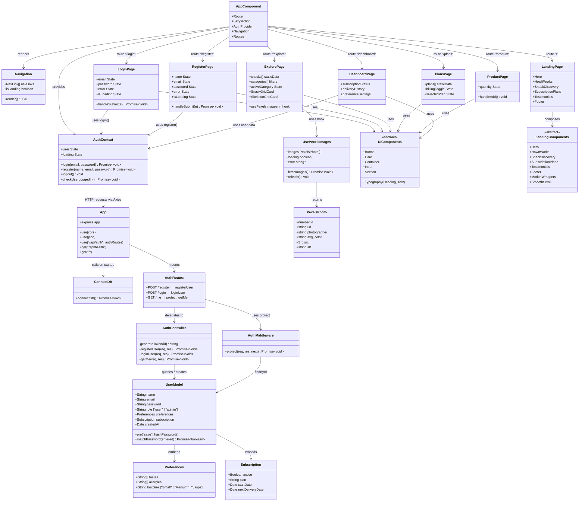

# SnackSafari — Class Diagram

## Class Summary

| Layer | Class | Responsibility |
|-------|-------|----------------|
| **Server** | `App` | Express app setup, middleware, route mounting |
| **Server** | `ConnectDB` | MongoDB connection via Mongoose |
| **Server** | `AuthRoutes` | Route definitions for `/api/auth` |
| **Server** | `AuthController` | Business logic for register, login, getMe |
| **Server** | `AuthMiddleware` | JWT token verification, route protection |
| **Server** | `UserModel` | Mongoose schema with password hashing |
| **Server** | `Preferences` | Embedded sub-document (tastes, allergies, boxSize) |
| **Server** | `Subscription` | Embedded sub-document (plan, dates, status) |
| **Client** | `AppComponent` | Root component with routing and providers |
| **Client** | `AuthContext` | Global auth state management (login/register/logout) |
| **Client** | `LoginPage` / `RegisterPage` | Authentication forms |
| **Client** | `ExplorePage` | Snack browsing with filtering and Pexels images |
| **Client** | `PlansPage` | Subscription plan display and selection |
| **Client** | `ProductPage` | Individual product detail and cart interaction |
| **Client** | `DashboardPage` | User subscription and preference management |
| **Client** | `UsePexelsImages` | Custom hook for Pexels API integration |
| **Client** | `UIComponents` | Reusable UI primitives (Button, Card, Input, etc.) |
