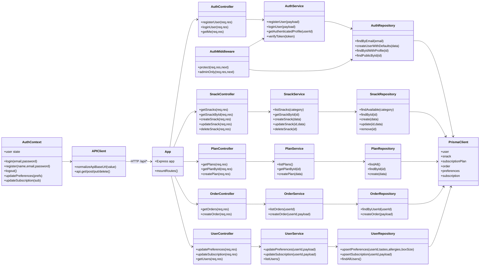

# SnackSafari - Class Diagram

```mermaid
classDiagram
    direction LR

    class App {
        +Express app
        +mountRoutes()
    }

    class AuthController {
        +registerUser(req,res)
        +loginUser(req,res)
        +getMe(req,res)
    }

    class SnackController {
        +getSnacks(req,res)
        +getSnackById(req,res)
        +createSnack(req,res)
        +updateSnack(req,res)
        +deleteSnack(req,res)
    }

    class PlanController {
        +getPlans(req,res)
        +getPlanById(req,res)
        +createPlan(req,res)
    }

    class OrderController {
        +getOrders(req,res)
        +createOrder(req,res)
    }

    class UserController {
        +updatePreferences(req,res)
        +updateSubscription(req,res)
        +getUsers(req,res)
    }

    class AuthService {
        +registerUser(payload)
        +loginUser(payload)
        +getAuthenticatedProfile(userId)
        +verifyToken(token)
    }

    class SnackService {
        +listSnacks(category)
        +getSnackById(id)
        +createSnack(data)
        +updateSnack(id,data)
        +deleteSnack(id)
    }

    class PlanService {
        +listPlans()
        +getPlanById(id)
        +createPlan(data)
    }

    class OrderService {
        +listOrders(userId)
        +createOrder(userId,payload)
    }

    class UserService {
        +updatePreferences(userId,payload)
        +updateSubscription(userId,payload)
        +listUsers()
    }

    class AuthRepository {
        +findByEmail(email)
        +createUserWithDefaults(data)
        +findByIdWithProfile(id)
        +findPublicById(id)
    }

    class SnackRepository {
        +findAvailable(category)
        +findById(id)
        +create(data)
        +update(id,data)
        +remove(id)
    }

    class PlanRepository {
        +findAll()
        +findById(id)
        +create(data)
    }

    class OrderRepository {
        +findByUserId(userId)
        +createOrder(payload)
    }

    class UserRepository {
        +upsertPreferences(userId,tastes,allergies,boxSize)
        +upsertSubscription(userId,payload)
        +findAllUsers()
    }

    class PrismaClient {
        +user
        +snack
        +subscriptionPlan
        +order
        +preferences
        +subscription
    }

    class AuthMiddleware {
        +protect(req,res,next)
        +adminOnly(req,res,next)
    }

    class AuthContext {
        +user state
        +login(email,password)
        +register(name,email,password)
        +logout()
        +updatePreferences(prefs)
        +updateSubscription(sub)
    }

    class APIClient {
        +normalizeApiBaseUrl(value)
        +api.get/post/put/delete()
    }

    App --> AuthController
    App --> SnackController
    App --> PlanController
    App --> OrderController
    App --> UserController

    AuthController --> AuthService
    SnackController --> SnackService
    PlanController --> PlanService
    OrderController --> OrderService
    UserController --> UserService

    AuthService --> AuthRepository
    SnackService --> SnackRepository
    PlanService --> PlanRepository
    OrderService --> OrderRepository
    UserService --> UserRepository

    AuthRepository --> PrismaClient
    SnackRepository --> PrismaClient
    PlanRepository --> PrismaClient
    OrderRepository --> PrismaClient
    UserRepository --> PrismaClient

    AuthMiddleware --> AuthService
    AuthMiddleware --> AuthRepository

    AuthContext --> APIClient
    APIClient --> App : HTTP /api/*
```

## OOP And Pattern Notes

- Encapsulation: each layer exposes a focused public API and hides implementation details.
- Single Responsibility: controllers handle HTTP, services handle business rules, repositories handle persistence.
- Repository Pattern: all Prisma operations are centralized in repository classes/modules.
- Service Layer Pattern: validation, token handling, and workflow logic live in services.
- Middleware Pattern: auth and authorization checks are reusable cross-cutting concerns.
