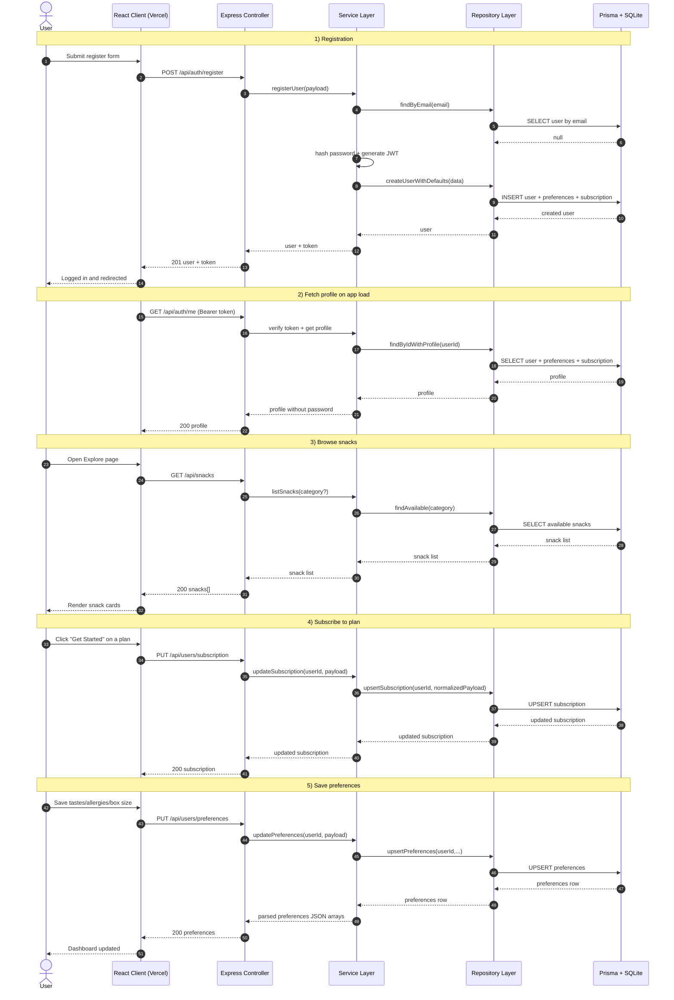

# SnackSafari - Sequence Diagram (End-to-End Main Flow)

Main flow: register -> login -> browse snacks -> subscribe -> update preferences.

```mermaid
sequenceDiagram
  autonumber

  actor U as User
  participant FE as React Client (Vercel)
  participant C as Express Controller
  participant S as Service Layer
  participant R as Repository Layer
  participant DB as Prisma + SQLite

  Note over U,DB: 1) Registration
  U->>FE: Submit register form
  FE->>C: POST /api/auth/register
  C->>S: registerUser(payload)
  S->>R: findByEmail(email)
  R->>DB: SELECT user by email
  DB-->>R: null
  S->>S: hash password + generate JWT
  S->>R: createUserWithDefaults(data)
  R->>DB: INSERT user + preferences + subscription
  DB-->>R: created user
  R-->>S: user
  S-->>C: user + token
  C-->>FE: 201 user + token
  FE-->>U: Logged in and redirected

  Note over U,DB: 2) Fetch profile on app load
  FE->>C: GET /api/auth/me (Bearer token)
  C->>S: verify token + get profile
  S->>R: findByIdWithProfile(userId)
  R->>DB: SELECT user + preferences + subscription
  DB-->>R: profile
  R-->>S: profile
  S-->>C: profile without password
  C-->>FE: 200 profile

  Note over U,DB: 3) Browse snacks
  U->>FE: Open Explore page
  FE->>C: GET /api/snacks
  C->>S: listSnacks(category?)
  S->>R: findAvailable(category)
  R->>DB: SELECT available snacks
  DB-->>R: snack list
  R-->>S: snack list
  S-->>C: snack list
  C-->>FE: 200 snacks[]
  FE-->>U: Render snack cards

  Note over U,DB: 4) Subscribe to plan
  U->>FE: Click "Get Started" on a plan
  FE->>C: PUT /api/users/subscription
  C->>S: updateSubscription(userId, payload)
  S->>R: upsertSubscription(userId, normalizedPayload)
  R->>DB: UPSERT subscription
  DB-->>R: updated subscription
  R-->>S: updated subscription
  S-->>C: updated subscription
  C-->>FE: 200 subscription

  Note over U,DB: 5) Save preferences
  U->>FE: Save tastes/allergies/box size
  FE->>C: PUT /api/users/preferences
  C->>S: updatePreferences(userId, payload)
  S->>R: upsertPreferences(userId,...)
  R->>DB: UPSERT preferences
  DB-->>R: preferences row
  R-->>S: preferences row
  S-->>C: parsed preferences JSON arrays
  C-->>FE: 200 preferences
  FE-->>U: Dashboard updated
```
