# SnackSafari — Sequence Diagram (Main Flow: End-to-End)

> **Flow**: User Registration → Login → Browse Snacks → View Product → Select Plan

---

## 1. User Registration & Login Flow

```mermaid
sequenceDiagram
    actor U as User (Browser)
    participant RC as React Client
    participant AC as AuthContext
    participant API as Express Server
    participant MW as Auth Middleware
    participant CTRL as AuthController
    participant M as User Model
    participant DB as MongoDB

    Note over U,DB: 🔐 Registration Flow

    U->>RC: Fill Register form (name, email, password)
    RC->>AC: register(name, email, password)
    AC->>API: POST /api/auth/register {name, email, password}
    API->>CTRL: registerUser(req, res)
    CTRL->>CTRL: Validate fields (name, email, password)
    CTRL->>M: User.findOne({ email })
    M->>DB: Query users collection
    DB-->>M: null (user not found)
    M-->>CTRL: null
    CTRL->>M: User.create({ name, email, password })
    M->>M: Pre-save hook: bcrypt.hash(password)
    M->>DB: Insert user document
    DB-->>M: Created user
    M-->>CTRL: user object
    CTRL->>CTRL: generateToken(user._id) via JWT
    CTRL-->>API: 201 { _id, name, email, token }
    API-->>AC: Response with JWT token
    AC->>AC: localStorage.setItem("token", token)
    AC->>AC: Set Authorization header
    AC->>AC: setUser(data)
    AC-->>RC: Auth state updated
    RC->>RC: navigate("/") → redirect to Home
    RC-->>U: Show Landing Page (authenticated)

    Note over U,DB: 🔑 Login Flow

    U->>RC: Fill Login form (email, password)
    RC->>AC: login(email, password)
    AC->>API: POST /api/auth/login {email, password}
    API->>CTRL: loginUser(req, res)
    CTRL->>M: User.findOne({ email }).select("+password")
    M->>DB: Query users collection
    DB-->>M: User document (with hashed password)
    M-->>CTRL: user object
    CTRL->>M: user.matchPassword(enteredPassword)
    M->>M: bcrypt.compare(entered, hashed)
    M-->>CTRL: true
    CTRL->>CTRL: generateToken(user._id)
    CTRL-->>API: 200 { _id, name, email, token }
    API-->>AC: Response with JWT token
    AC->>AC: Store token, set headers, setUser
    AC-->>RC: Auth state updated
    RC->>RC: navigate("/")
    RC-->>U: Show Landing Page (authenticated)
```

---

## 2. Session Verification (On App Load)

```mermaid
sequenceDiagram
    actor U as User (Browser)
    participant RC as React Client
    participant AC as AuthContext
    participant API as Express Server
    participant MW as Auth Middleware
    participant CTRL as AuthController
    participant M as User Model
    participant DB as MongoDB

    Note over U,DB: 🔄 Auto-login Check (useEffect on mount)

    U->>RC: Open application
    RC->>AC: AuthProvider mounts
    AC->>AC: Check localStorage for token
    alt Token exists
        AC->>AC: Set Authorization header
        AC->>API: GET /api/auth/me
        API->>MW: protect middleware
        MW->>MW: Extract token from "Bearer <token>"
        MW->>MW: jwt.verify(token, JWT_SECRET)
        MW->>M: User.findById(decoded.id)
        M->>DB: Query by _id
        DB-->>M: User document
        M-->>MW: user object
        MW->>MW: req.user = user
        MW->>CTRL: next()
        CTRL-->>API: 200 req.user
        API-->>AC: User data
        AC->>AC: setUser(data), setLoading(false)
    else No token
        AC->>AC: setLoading(false)
    end
    AC-->>RC: Render app (loading complete)
    RC-->>U: Display appropriate page
```

---

## 3. Browse Snacks & Explore Flow

---

## 4. Subscription Plan Selection Flow

