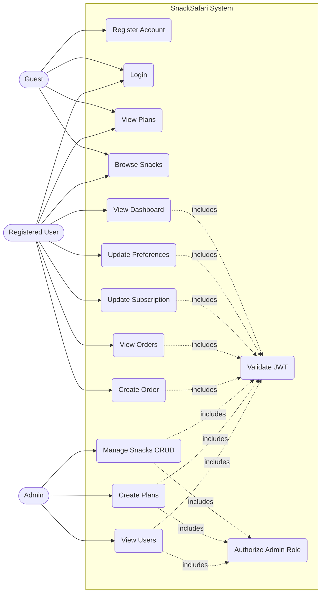

# SnackSafari - Use Case Diagram

```mermaid
graph LR
    Guest([Guest])
    User([Registered User])
    Admin([Admin])

    subgraph SnackSafari System
        UC1(Register Account)
        UC2(Login)
        UC3(View Plans)
        UC4(Browse Snacks)
        UC5(View Dashboard)
        UC6(Update Preferences)
        UC7(Update Subscription)
        UC8(View Orders)
        UC9(Create Order)
        UC10(Manage Snacks CRUD)
        UC11(Create Plans)
        UC12(View Users)
        UC13(Validate JWT)
        UC14(Authorize Admin Role)
    end

    Guest --> UC1
    Guest --> UC2
    Guest --> UC3
    Guest --> UC4

    User --> UC2
    User --> UC5
    User --> UC6
    User --> UC7
    User --> UC8
    User --> UC9
    User --> UC3
    User --> UC4

    Admin --> UC10
    Admin --> UC11
    Admin --> UC12

    UC5 -. includes .-> UC13
    UC6 -. includes .-> UC13
    UC7 -. includes .-> UC13
    UC8 -. includes .-> UC13
    UC9 -. includes .-> UC13

    UC10 -. includes .-> UC13
    UC10 -. includes .-> UC14
    UC11 -. includes .-> UC13
    UC11 -. includes .-> UC14
    UC12 -. includes .-> UC13
    UC12 -. includes .-> UC14
```

## Summary

- Guest users can register, login, browse snacks, and view plans.
- Registered users can manage profile data, preferences, subscription, and orders.
- Admin users can perform protected CRUD and management operations.
- JWT authentication and role checks are reusable included behaviors.
