# SnackSafari — Use Case Diagram

```mermaid
graph TB
    subgraph System["🌍 SnackSafari Platform"]

        UC1["Register Account"]
        UC2["Login"]
        UC3["Logout"]
        UC4["View Profile / Dashboard"]
        UC5["Browse Snacks (Explore)"]
        UC6["View Product Details"]
        UC7["Filter Snacks by Category"]
        UC8["View Subscription Plans"]
        UC9["Select Subscription Plan"]
        UC10["Manage Subscription"]
        UC11["Set Snack Preferences"]
        UC12["View Delivery Status"]
        UC13["Manage Products (CRUD)"]
        UC14["View User Analytics"]
        UC15["Manage Users"]

        UC16["Authenticate via JWT"]
        UC17["Hash Password"]
        UC18["Fetch Snack Images (Pexels API)"]
    end

    Guest(["👤 Guest User"])
    User(["🧑 Registered User"])
    Admin(["🔑 Admin"])
    PexelsAPI(["📸 Pexels API"])
    MongoDB(["🗄️ MongoDB"])

    %% Guest interactions
    Guest --> UC1
    Guest --> UC2
    Guest --> UC5
    Guest --> UC6
    Guest --> UC8

    %% Registered User interactions
    User --> UC2
    User --> UC3
    User --> UC4
    User --> UC5
    User --> UC6
    User --> UC7
    User --> UC8
    User --> UC9
    User --> UC10
    User --> UC11
    User --> UC12

    %% Admin interactions
    Admin --> UC13
    Admin --> UC14
    Admin --> UC15

    %% Include / Extend relationships
    UC1 -.->|includes| UC17
    UC2 -.->|includes| UC16
    UC5 -.->|includes| UC18
    UC16 -.->|uses| MongoDB
    UC18 -.->|uses| PexelsAPI

    %% Styling
    classDef actor fill:#FFF3E0,stroke:#FF6D00,stroke-width:2px,color:#333
    classDef usecase fill:#FFF8E1,stroke:#F9A825,stroke-width:1px,color:#333
    classDef external fill:#E3F2FD,stroke:#1565C0,stroke-width:2px,color:#333

    class Guest,User,Admin actor
    class UC1,UC2,UC3,UC4,UC5,UC6,UC7,UC8,UC9,UC10,UC11,UC12,UC13,UC14,UC15,UC16,UC17,UC18 usecase
    class PexelsAPI,MongoDB external
```

## Actors

| Actor | Description |
|-------|-------------|
| **Guest User** | Unauthenticated visitor — can browse snacks, view plans, and register/login |
| **Registered User** | Authenticated user — can manage subscriptions, set preferences, view dashboard |
| **Admin** | Platform administrator — manages products, users, and analytics |
| **Pexels API** | External service providing snack/food images |
| **MongoDB** | Database storing users, subscriptions, and product data |

## Use Cases Summary

| # | Use Case | Primary Actor(s) |
|---|----------|-------------------|
| UC1 | Register Account | Guest |
| UC2 | Login | Guest, User |
| UC3 | Logout | User |
| UC4 | View Profile / Dashboard | User |
| UC5 | Browse Snacks (Explore) | Guest, User |
| UC6 | View Product Details | Guest, User |
| UC7 | Filter Snacks by Category | User |
| UC8 | View Subscription Plans | Guest, User |
| UC9 | Select Subscription Plan | User |
| UC10 | Manage Subscription | User |
| UC11 | Set Snack Preferences | User |
| UC12 | View Delivery Status | User |
| UC13 | Manage Products (CRUD) | Admin |
| UC14 | View User Analytics | Admin |
| UC15 | Manage Users | Admin |
